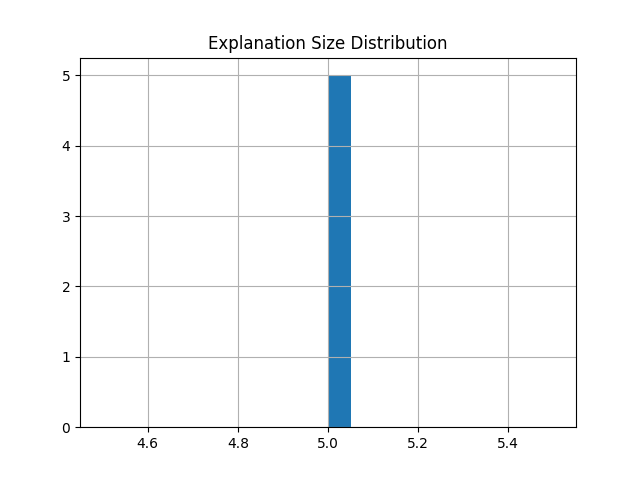
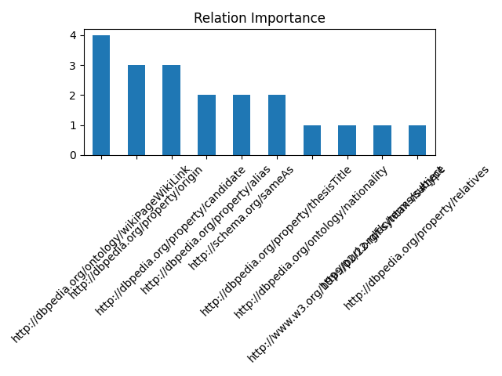
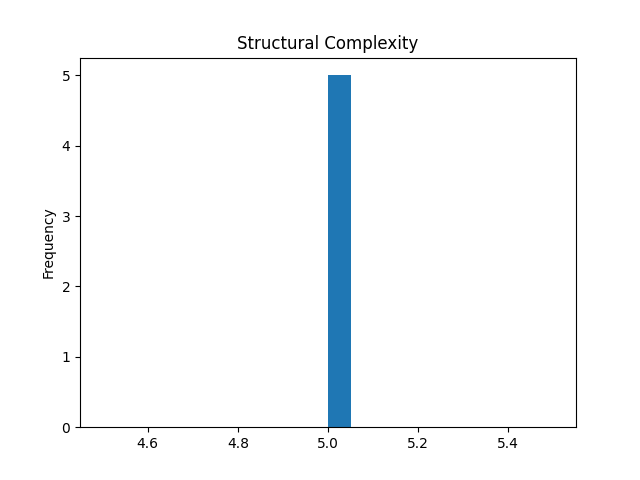
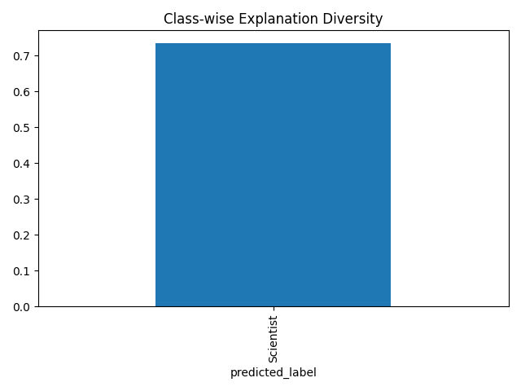
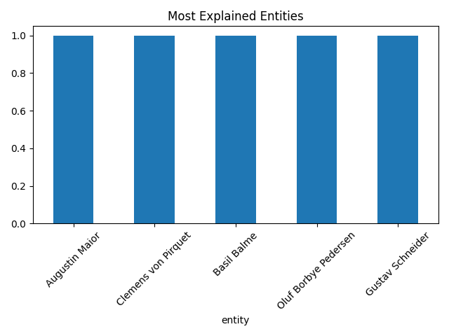

# Grad Explanation Report

## Overview
- Nodes: 5
- Avg explanation size: 5.00

---

## Figures

### Prediction Distribution

### Explanation Size

### Relation Importance

### Structural Complexity

### Class-wise Explanation Strength

### Entity Coverage

---

## Sample Explanation

Augustin Maior is classified as Scientist.

The model uses relationships in the knowledge graph.

Key evidence:
- Romanian --[http://dbpedia.org/property/alias]--> Augustin Maior
- Augustin Maior --[http://dbpedia.org/ontology/nationality]--> Romanian
- Augustin Maior --[http://dbpedia.org/property/candidate]--> Physics
- Augustin Maior --[http://dbpedia.org/property/origin]--> Physics
- Augustin Maior --[http://purl.org/dc/terms/subject]--> Physics

This explanation is purely graph-structural.

---

Generated automatically by Step 7 pipeline.
