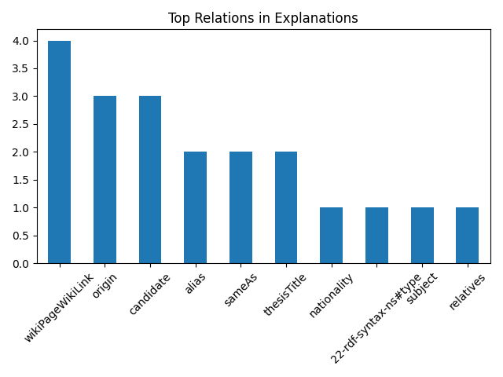

# Grad Explanation Report

This report summarises the explanations generated by the R-GCN model for node classification on the DBpedia dataset. It analyses the overall explanation quality, important relation types, and provides an example explanation for one prediction.

## 1. Dataset Overview

| Metric | Value |
|--------|-------|
|Number of explained entities|5|
|Average explanation size|2.80 edges|
|Different relation types|8|
|Average Fidelity|0.733|
|Average Sparsity|0.273|

Each prediction is explained using a small subgraph extracted from the knowledge graph. These explanations help understand which information was most influential for the model's decision.

## 2. Prediction Distribution

| Class | Number of Predictions |
|------|-----------------------|
|Scientist|5|

The figure above shows how predictions are distributed across the different classes. A balanced distribution suggests that the model does not heavily favour one class over another.

## 3. Explanation Size Analysis

The average explanation contains **2.80 graph edges**. Smaller explanations are generally easier for humans to understand, while larger explanations provide more supporting evidence for the prediction.

The histogram illustrates how explanation sizes vary among all entities. Most explanations remain relatively compact, making them suitable for interpretation.

## 4. Most Important Relation Types

The following table lists the ten relation types that appear most frequently across all generated explanations.

| Rank | Relation | Frequency |
|-----|----------|-----------|
|1|wikiPageWikiLink|4|
|2|origin|3|
|3|sameAs|2|
|4|nationality|1|
|5|subject|1|
|6|relatives|1|
|7|profession|1|
|8|prizes|1|

Relations appearing frequently across explanations indicate that they provide useful information for distinguishing between entity classes. These relation types represent the structural patterns that the R-GCN has learned from the knowledge graph.

## 5. Fidelity versus Sparsity

This figure compares explanation fidelity with explanation sparsity for every explained entity.

- **Fidelity** measures how much useful information is retained in the explanation.
- **Sparsity** measures how compact the explanation is.

An ideal explanation achieves both high fidelity and high sparsity, meaning that it remains easy to understand while still containing sufficient evidence for the prediction.

## 6. Class-wise Explanation Quality

| Class | Average Fidelity |
|------|------------------|
|Scientist|0.733|

Higher fidelity indicates that explanations for that class use a larger variety of meaningful relation types. Lower values suggest that predictions rely on fewer types of relations.

## 7. Example Prediction

**Entity:** Augustin Maior

**Predicted Class:** Scientist

**Human-readable explanation:**

The model predicts that Augustin Maior belongs to the Scientist category because the available information shows that it is from Romanian and has a background in Physics. Together, these characteristics are commonly associated with this category.

## 8. Overall Findings

- The R-GCN model learns from semantic relationships between entities rather than isolated attributes.
- Frequently occurring relation types indicate which information contributes most often to predictions.
- Most explanations remain compact while preserving sufficient evidence for understanding model decisions.
- Human-readable explanations convert graph evidence into simple language, making the predictions easier for non-technical users to interpret.
