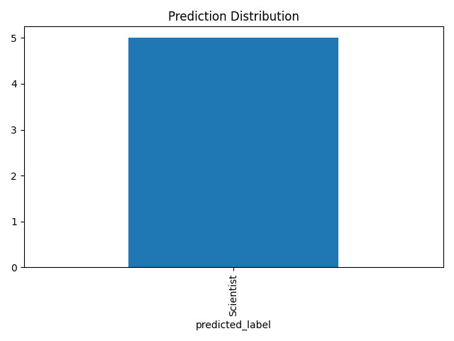
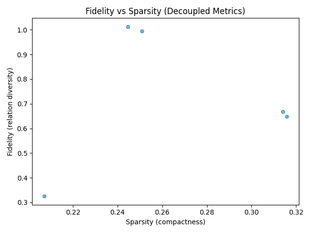

# Grad Explanation Report

## 1. Dataset Overview

- Nodes: 5
- Avg explanation size: 2.80
- Relations discovered: 8

## 2. Explanation Behavior Analysis

The model generates explanations based on subgraphs of DBpedia relations. We observe variation in both compactness and relational diversity across nodes.

## 3. Metric Interpretation

- Sparsity: measures how compact the explanation is
- Fidelity: measures diversity of semantic relations used

High fidelity with moderate sparsity indicates informative yet compact explanations.

## 4. Visual Summary

### Prediction Distribution

### Fidelity vs Sparsity

## 5. Case Study

Entity: Augustin Maior

Predicted Label: Scientist

Key relational evidence:

- Augustin Maior --[nationality]--> Romanian
- Augustin Maior --[origin]--> Physics
- Augustin Maior --[subject]--> Physics

This demonstrates how relational structure guides prediction decisions.

## 6. Key Insight

The model does not rely on a single type of relation but instead distributes importance across multiple semantic edges, showing robustness in explanation structure.
